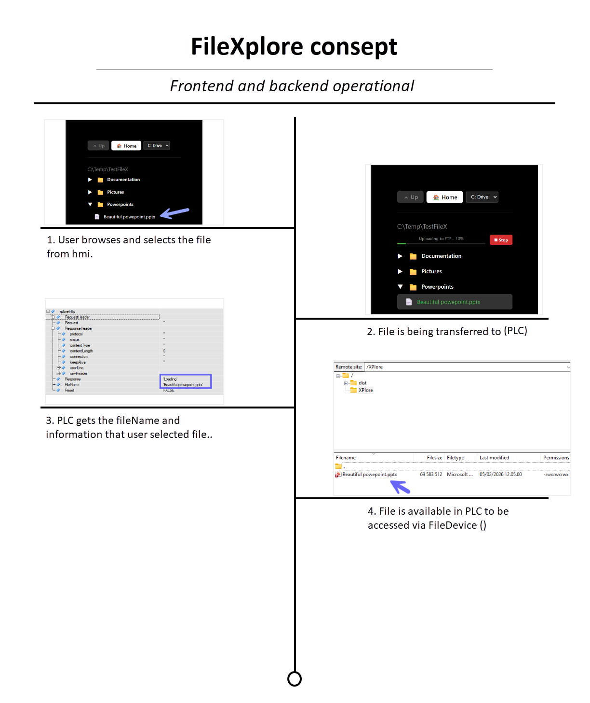
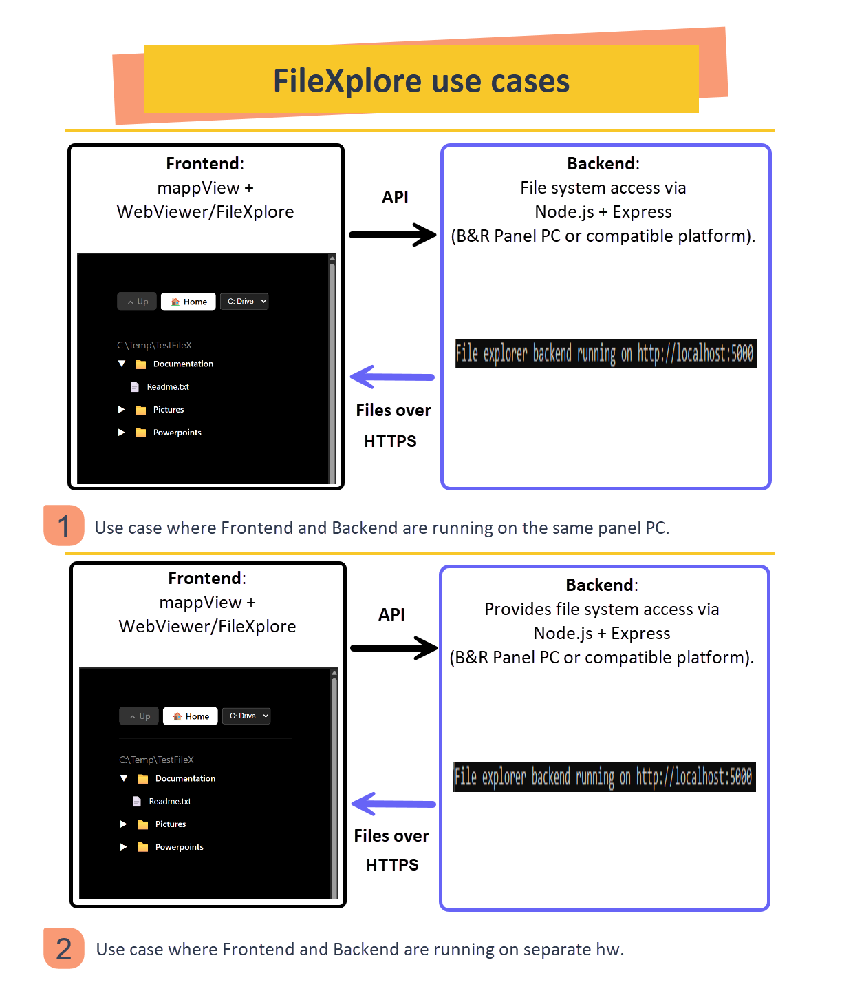
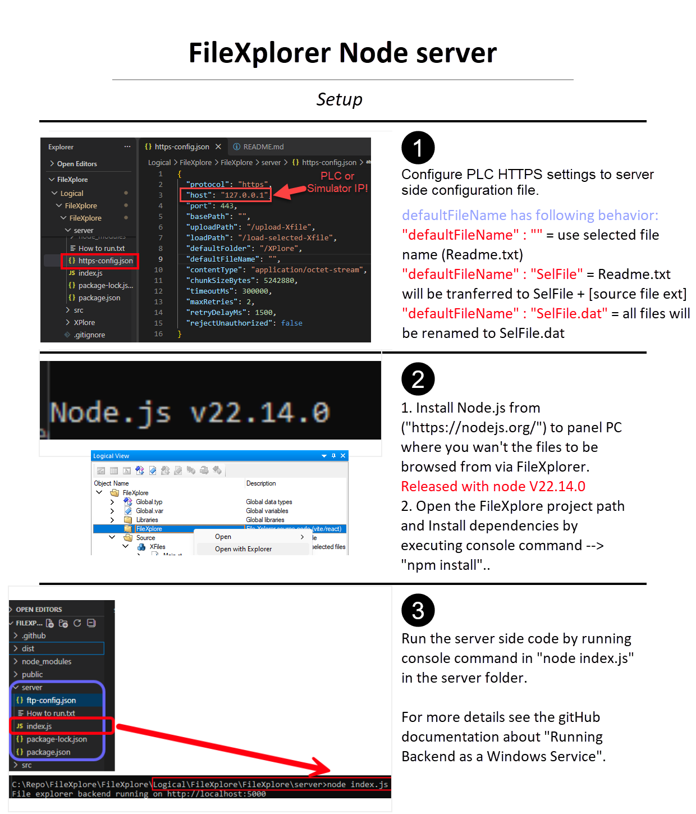
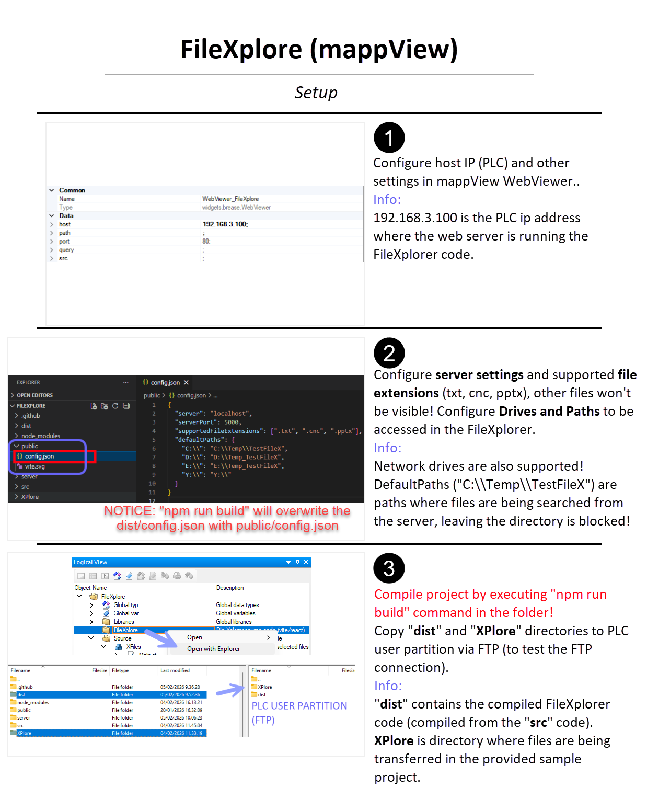

# FileXplore - B&R Automation Studio 6 Sample Project
Here is a complete **B&R Automation Studio 6** sample project featuring a Vite + React file explorer application with a Node.js backend. The application enables browsing local files and transferring them to a PLC over chunked HTTPS, with real-time progress tracking.

For release notes and version history, see [CHANGELOG.md](Logical/FileXplore/FileXplore/CHANGELOG.md).

# Basic consept

# Use cases

# 1. Setup backend

# 2. Setup mappView

For detailed information about the web application component, see [Logical/FileXplore/FileXplore/README.md](Logical/FileXplore/FileXplore/README.md).

